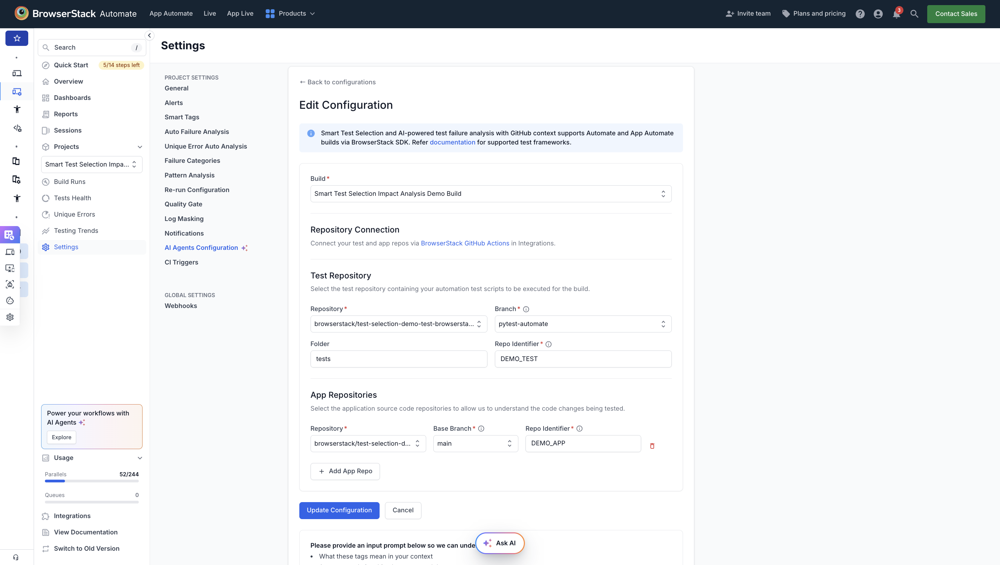
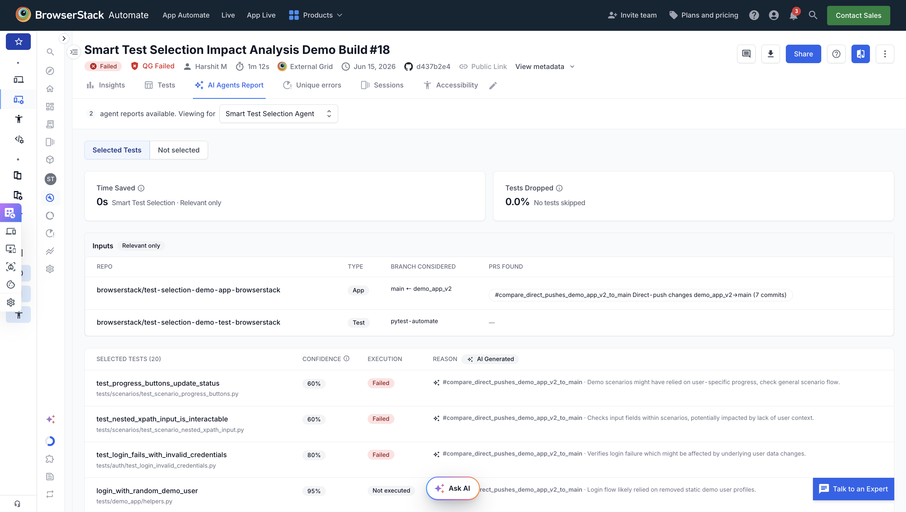

# Smart Test Selection & Orchestration AI Agent Demo for BrowserStack Automate

## Table of Contents
- [What is Smart Test Selection?](#what-is-smart-test-selection)

- [How Smart Test Selection Agent Works](#how-smart-test-selection-agent-works)

- [Steps to run the demo](#steps-to-run-the-demo)

---

## What is Smart Test Selection?
BrowserStack's Smart Test Selection Agent uses AI to identify and run only the tests impacted by your code changes, reducing build time and cost. This demo uses the BrowserStack Python SDK with PyTest: 
- App Repo – [test-selection-demo-app-browserstack](https://github.com/browserstack/test-selection-demo-app-browserstack)
- Test Repo – [test-selection-demo-test-browserstack](https://github.com/browserstack/test-selection-demo-test-browserstack)
  
---

## How Smart Test Selection Agent Works
- Agent does a static analysis of the test repo to understand the tests structure, workflows being tested etc. Based on the code changes and static analysis done earlier, it then predicts impacted tests for incoming builds.
- Agent needs read-only access to the application repo and test repo - this can be given via BrowserStack Github app

For detailed integration steps follow the [Test Selection Documentation](https://www.browserstack.com/docs/automate/selenium/smart-test-selection).

## Steps to run the demo
- This demo showcases BrowserStack's Impact Analysis agent using the **Github App** integration approach.
- First, we run a build with Impact Analysis disabled and then run the same build with it enabled, allowing you to clearly see the impact - with Impact Analysis, only the tests impacted by the code change run, resulting in a reduction in execution time.
  
### Prerequisites
- Python 3.9+
- BrowserStack Account with AI Enabled: [Activate BrowserStack AI preferences](https://www.browserstack.com/docs/iaam/settings-and-permissions/activate-browserstack-ai)
  
### Step 1: Setup Test Repo
 
```
# Clone the test repo
git clone https://github.com/browserstack/test-selection-demo-test-browserstack.git
cd test-selection-demo-test-browserstack

> If your org is not `browserstack`, fork the test and app repos into your own org first, and clone the forked test repo instead.

# Checkout the pytest demo branch
git checkout pytest-automate
 
# Create and activate a virtual environment
python3 -m venv env
source env/bin/activate   # on Mac
env\Scripts\activate      # on Windows
 
# Install dependencies
pip install -r requirements.txt
```
 
### Step 2: Add BrowserStack Credentials
- Update `username` and `accessKey` in the `browserstack.yml` file with your BrowserStack access credentials found [here](https://www.browserstack.com/accounts/profile/details)
```
userName: <your-browserstack-username>
accessKey: <your-browserstack-accesskey>
```
 
### Step 3: Connect your repos for Impact Analysis
- Provide read-only access to the demo test and app repos via [BrowserStack GitHub Actions](https://automate.browserstack.com/integrations?category=cicd) in Integrations (user with BrowserStack Admin + Github Admin access can configure the repos)
- In the AI Agents Configuration page under Settings in BrowserStack, add the details for the test repo (e.g. `pytest-automate` branch, `tests` folder) along with the app repo.
A sample configuration is shown in the image below
  

- Update the app repo reference used for impact mapping:
  Create a test-selection.json file in the demo test repo. Specify the feature branch of the app repo (which has the code changes). A sample is shown below 
```json
{
  "DEMO_APP": {
    "url": "https://github.com/<YOUR_ORG>/test-selection-demo-app-browserstack",
    "featureBranch": "demo-temp"
  }
}
```
  Replace `<YOUR_ORG>` with your own GitHub org (not `browserstack`).
- Once configured, trigger static analysis of the test repo by clicking on 'Analyse Test Repo' in AI Agent Configuration settings — this is required before running a build with Impact Analysis enabled, and takes 5-10 minutes.

### Step 4: Run a build without Impact Analysis enabled
- In `browserstack.yml`, add projectName, buildName and disable Test Selection
```yaml
projectName: Smart Test Selection Impact Analysis Demo Project
buildName: Smart Test Selection Impact Analysis Demo Build

testOrchestrationOptions:
  runSmartSelection:
    enabled: false
    mode: 'relevantOnly'
```

- Run the build with:
```
browserstack-sdk pytest tests/
```
- Results:
  - All tests in the suite run
  - This is our baseline - the full suite always runs regardless of which parts of the code changed

### Step 5: Run a build with Impact Analysis enabled
- In `browserstack.yml`, enable Test Selection
```yaml
projectName: Smart Test Selection Impact Analysis Demo Project
buildName: Smart Test Selection Impact Analysis Demo Build

testOrchestrationOptions:
  runSmartSelection:
    enabled: enable
    mode: 'relevantOnly'
```

- Run the build with:
```
browserstack-sdk pytest tests/
```
- Results:
  - Impact Analysis analyzes the code changes in the demo app
  - It determines which tests are impacted by those changes
  - Instead of running the full suite, the agent selects and runs only the impacted tests
  - All other unimpacted tests are automatically skipped/dropped
---

### Step 6: View Test Selection Report
- Once the build with Impact Analysis enabled completes, open the build on the BrowserStack Automate dashboard and go to the **Test Selection Report** in the AI Agents Report tab.
- The report shows:
  - The list of tests selected to run for this build
  - The reasoning behind why the agent selected each test 
  - The tests that were skipped, since they weren't impacted by the code change

  

---

## Notes
* You can view your test results on the [BrowserStack Automate dashboard](https://www.browserstack.com/automate)
